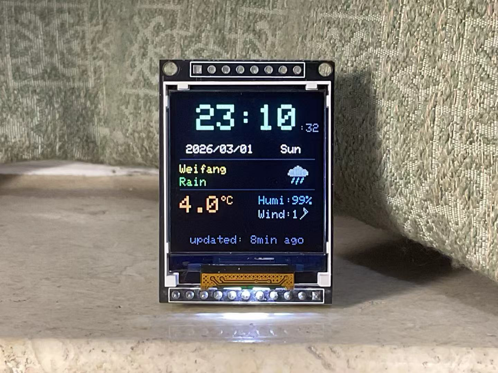
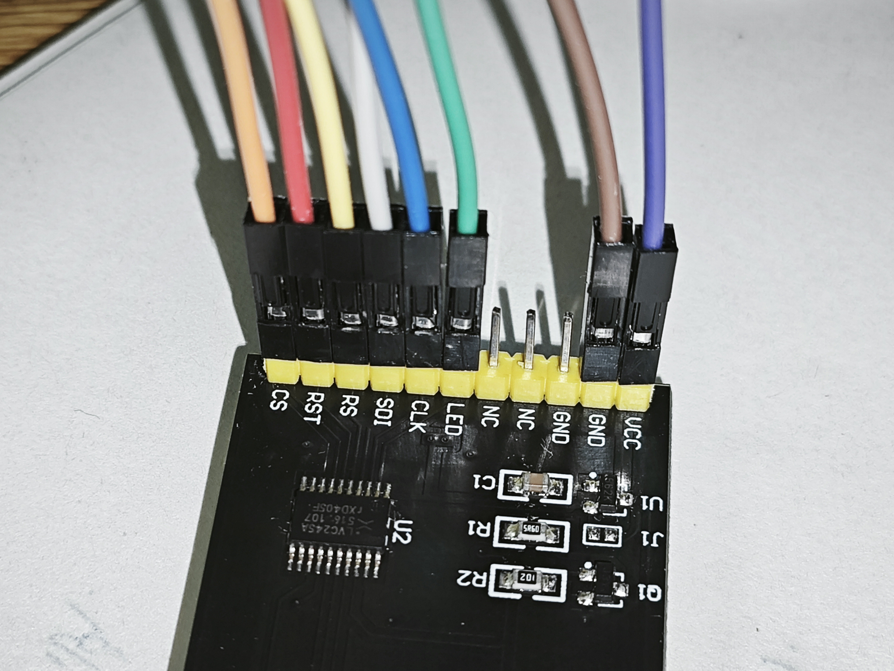
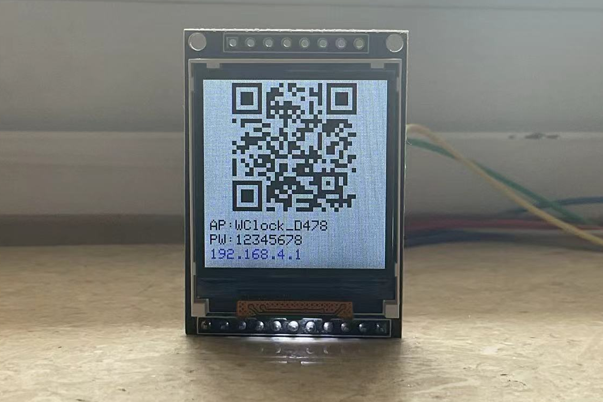
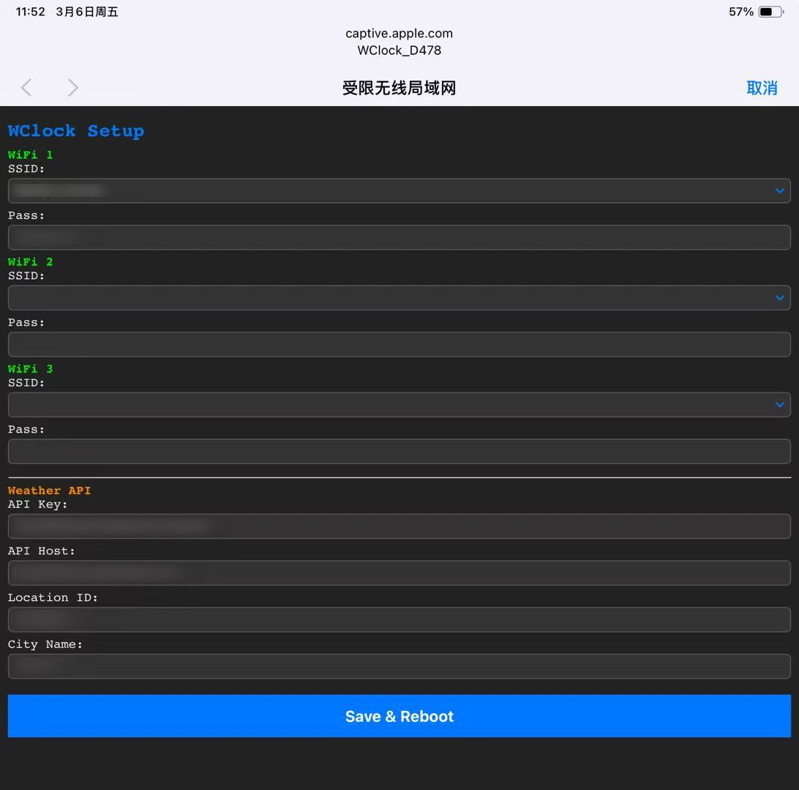

# ESP8266 Weather Clock

基于 ESP8266 + ST7735 1.44 寸 TFT 屏幕 (128x128) 的天气时钟。通过和风天气 API 获取实时天气数据，NTP 自动同步时间，支持 Web 配网。



## 功能

- **实时时钟** - NTP 自动校时（每 1 小时），大字体显示时分，小字体显示秒，逐字符对比刷新无闪烁
- **日期显示** - 年/月/日 + 星期几，仅日期变化时重绘
- **实时天气** - 温度、湿度、风向、风力等级，每 10 分钟自动更新
- **18x18 像素天气图标** - 18 种手绘图标覆盖晴/云/阴/雨/雷暴/雪/雨夹雪/冻雨/雾/霾/沙尘/沙尘暴等天气
- **风向小旗** - 像素绘制的风向标，支持 8 方向
- **Web 配网** - AP 热点 + Captive Portal + QR 码，手机扫码即可配置 WiFi 和天气 API，无需改代码
- **多 WiFi 支持** - 最多保存 3 组 WiFi，开机自动扫描并连接信号最强的已保存网络
- **EEPROM 持久化** - WiFi 凭据和天气 API 配置存储在 EEPROM
- **D6 按键操作** - D6 接地触发配网模式或强制刷新天气/NTP
- **省电设计** - WiFi 射频仅在更新时开启，空闲时完全关闭；`WiFi.persistent(false)` 避免频繁写 flash 导致寿命缩短
- **零堆碎片** - 天气数据使用固定大小 `char[]` 缓冲区，避免 Arduino `String` 动态分配导致的堆碎片化，提升长期运行稳定性

## 硬件

| 组件 | 型号 |
|------|------|
| 主控 | ESP8266 (NodeMCU / D1 Mini) |
| 屏幕 | ST7735 1.44 寸 128x128 TFT |

### 接线

| TFT 引脚 | ESP8266 引脚 | 说明 |
|-----------|-------------|------|
| CS | D1 (GPIO5) | 片选 |
| RS | D3 (GPIO0) | 数据/命令 |
| RST | D2 (GPIO4) | 复位 |
| LED | D4 (GPIO2) | 背光 |
| CLK | D5 (GPIO14) | SPI 时钟 |
| SDI | D7 (GPIO13) | SPI 数据 |
| VCC | 3.3V | 电源 |
| GND | GND | 地线 |




### 配网触发引脚

| 引脚 | ESP8266 引脚 | 说明 |
|------|-------------|------|
| 配网/刷新 | D6 (GPIO12) | 接地触发（内部上拉） |

## 依赖库

通过 Arduino IDE 库管理器安装：

- **Adafruit GFX Library**
- **Adafruit ST7735 and ST7789 Library**
- **ArduinoJson** (by Benoit Blanchon)

项目自带：

- **uzlib** - Gzip 解压（`uzlib.h` + `uzlib.c`，和风天气 API 返回 Gzip 压缩数据）
- **qrcodegen** - QR 码生成（配网模式下在屏幕上显示 WiFi 连接二维码，来自[nayuki/QR-Code-generator](https://github.com/nayuki/QR-Code-generator/tree/master/c)）

## 配置

所有配置通过 Web 配网页面完成，无需修改代码。

### 首次使用 / 进入配网模式

1. **D6 引脚接地** + 按 RST 复位（或首次无 WiFi 配置时自动进入）

2. 屏幕显示 QR 码和 AP 信息：
   - AP 名称：`WClock_XXXX`（XXXX 为芯片 ID 后 4 位）
   - AP 密码：`12345678`

3. 手机扫描 QR 码或手动连接该热点



4. 自动弹出配置页面（苹果会弹出来，安卓好像不会），或浏览器访问 `192.168.4.1`

   

5. 在页面中填写：
   - **WiFi 1~3** - SSID 和密码（支持从扫描列表中选择，最多 3 组）
   - **Weather API** - API Key、API Host、Location ID、City Name

6. 点击 **Save & Reboot**，设备自动重启并连接 WiFi

### 和风天气 API

需要在 [和风天气开发平台](https://dev.qweather.com/) 注册并创建凭据：

- **API Key** - 在控制台创建的密钥
- **API Host** - 在 [控制台-设置](https://console.qweather.com/setting) 中查看，格式类似 `xxxxxx.re.qweatherapi.com`
- **Location ID** - 城市 ID
- **City Name** - 屏幕上显示的城市名称（英文，最多 15 字符）

### 城市 ID

常用城市 ID：

| 城市 | ID |
|------|----|
| 北京 | 101010100 |
| 上海 | 101020100 |
| 广州 | 101280101 |
| 深圳 | 101280601 |

其他城市可通过和风天气[Github LocationList 页面](https://github.com/qwd/LocationList/blob/master/China-City-List-latest.csv)查询。

### 刷新间隔

刷新间隔在代码中定义，如需修改需编辑 `weather_clock.ino`：

```cpp
const unsigned long WEATHER_INTERVAL = 600000;   // 天气刷新: 10 分钟
const unsigned long NTP_INTERVAL     = 3600000;  // NTP 校时: 1 小时
const unsigned long CLOCK_INTERVAL   = 1000;     // 时钟刷新: 1 秒
```

## D6 按键操作

D6 引脚接地触发操作：

| 场景 | 操作 | 效果 |
|------|------|------|
| 开机时 D6 接地 | 保持 D6 接地 + 按 RST重启 | 进入配网模式 |
| 天气配置缺失提示时 | 接地 1 次 | 提示文字变暗 |
| 首次获取 / 上次获取天气失败时 | 接地 1 次 | 立即强制刷新天气 + NTP |
| 天气正常显示时 | 2 秒内接地 3 次 | 强制刷新天气 + NTP |

## 运行流程

### 开机流程

```
上电
 ├─ 读取 D6 引脚状态（判断是否强制配网）
 ├─ 初始化屏幕和背光
 ├─ WiFi.persistent(false) — 禁止写 flash
 ├─ 从 EEPROM 加载 WiFi 配置和天气 API 配置
 ├─ D6 接地 或 无 WiFi 配置？
 │   └─ 是 → 进入配网模式（AP + Web + QR 码，配置保存后自动重启）
 ├─ 自动扫描并连接已保存的 WiFi（扫描 2 轮，匹配后尝试连接 2 次）
 │   ├─ 成功 → NTP 校时 → 获取天气 → 关闭 WiFi → 绘制界面 → 进入主循环
 │   └─ 全部失败 → 关闭 WiFi → 屏幕显示错误信息 → 停机（D6 接地 + RST 重新配网）
 └─
```

### 主循环

```
loop() 每次循环
 ├─ 每 1 秒: 更新时钟显示（逐字符对比，无闪烁）
 ├─ 每 1 分钟: 更新 "updated Xmin ago" 显示
 ├─ 天气配置缺失提示 1 分钟后自动变暗
 ├─ D6 接地检测（防抖 + 三击/单击逻辑）
 └─ 每 10 分钟（天气到期时）:
     ├─ 开启 WiFi 射频
     ├─ WiFi.begin() 连接（15 秒超时）
     ├─ 成功: 更新天气，NTP 到期时顺便校时（搭便车）
     ├─ 失败: 标记失败，跳过本次
     └─ 关闭 WiFi 射频，回到省电模式
```

### WiFi 失败屏幕

开机连接全部失败时显示：

```
WiFi connect failed

To reconfigure:
D6 to GND + reset

Restart to retry
```

## EEPROM 布局

| 地址 | 长度 | 内容 |
|------|------|------|
| 0 | 1 | Magic byte (0xA5) |
| 1 | 97x3 = 291 | WiFi Slot 0~2（各 33 字节 SSID + 64 字节密码） |
| 289 | 64 | API Key |
| 353 | 64 | API Host |
| 417 | 16 | Location ID |
| 433 | 16 | City Name |

总计使用 449 字节，EEPROM 分配 512 字节。

## 天气图标

18x18 像素手绘图标，共 18 种样式，覆盖和风天气大部分图标代码：

| 图标 | 和风代码 | 说明 |
|------|---------|------|
| 晴 | 100, 150 |  |
| 白天多云 | 101-103 |  |
| 夜间多云 | 151-153 |  |
| 阴天 | 104 |  |
| 小雨/阵雨 | 300, 301, 305, 309, 350, 351 |  |
| 雷阵雨 | 302-304 |  |
| 中雨 | 306, 314, 315, 399 |  |
| 大雨/暴雨 | 307-312, 316-318 |  |
| 冻雨 | 313 |  |
| 小雪 | 400 |  |
| 中雪 | 401, 408 |  |
| 大雪/暴雪 | 402, 403, 409, 410, 499 |  |
| 雨夹雪 | 404-407, 456, 457 |  |
| 雾 | 500, 501, 509, 510, 514, 515 |  |
| 霾 | 502, 511-513 |  |
| 扬沙/浮尘 | 503, 504 |  |
| 沙尘暴 | 507, 508 |  |
| 未知 | 其他代码 |  |

全部为手工绘制，可能比较丑，有需要的可以自行重新绘制

## 文件结构

```
weather_clock/
  weather_clock.ino   # 主程序
  uzlib.h             # Gzip 解压库头文件
  uzlib.c             # Gzip 解压库源码
  qrcodegen.h         # QR 码生成库头文件
  qrcodegen.c         # QR 码生成库源码
  README.md           # 本文件
```
